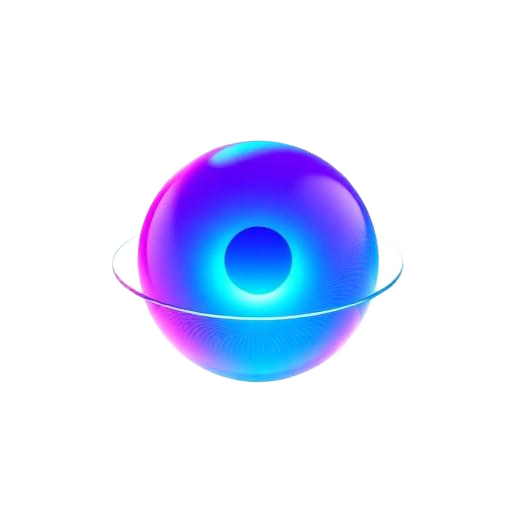

# ⌬ ARIA — Autonomous Reasoning & Interaction Agent

<p align="center">
    <picture>
        
    </picture>
</p>

<p align="center">
  <strong>VISION FOR YOUR COMPUTER</strong>
</p>

<p align="center">
  <a href="https://github.com/ariacore/aria-beta/actions/workflows/publish.yml"></a>
  <a href="https://github.com/ariacore/aria-beta/releases"></a>
  <a href="https://www.npmjs.com/package/@aria/cli"></a>
  <a href="LICENSE"></a>
</p>

**ARIA** is a *personal AI assistant* that natively controls your own devices.
Unlike browser extensions or DOM-parsing scripts, ARIA relies on **Pure Vision**. If a human can see it, ARIA can interact with it. It answers you on the channels you already use (Telegram, Webhook, Email) and renders a visual workspace of its actions. 

If you want an autonomous, single-user assistant that feels local, fast, and capable of operating any software on your computer, this is it.

[Vision](VISION.md) · [Architecture](ARCHITECTURE.md) · [Contributing](CONTRIBUTING.md) · [NPM Registry](https://www.npmjs.com/package/@aria/cli)

Preferred setup: run `aria onboard` in your terminal.
ARIA guides you step by step through setting up your LLM providers, execution mode, and notification channels.

## Sponsors & Backers

*ARIA is community-driven. Sponsor us to get your logo here.*

## Models (selection + auth)

ARIA is completely provider-agnostic. We currently support:
- **Anthropic** (Claude 3.5 Sonnet) - *Recommended*
- **OpenAI** (GPT-4o)
- **Google** (Gemini 1.5 Pro)
- **Local/Open-Weights** via Ollama (Qwen2-VL, LLaVA)

## Install (recommended)

Runtime: **Node 22 LTS or newer**.

```bash
npm install -g @aria/cli@latest
# or: pnpm add -g @aria/cli@latest

aria onboard
```

## Quick start (TL;DR)

```bash
aria onboard

# Start the daemon
aria serve

# Direct CLI usage
aria run "Open YouTube, search for trending music, and take a screenshot"
```

## How it works (short)

```text
Telegram / CLI / Webhook / Email
               │
               ▼
┌───────────────────────────────┐
│          ARIA Gateway         │
│     (orchestration layer)     │
└──────────────┬────────────────┘
               │
               ├─ Vision LLM (Perception)
               ├─ LanceDB (Memory)
               ├─ Safety Gate (HITL)
               └─ Computer Controller (Action)
                         │
                         ▼
             Windows / macOS / Linux
```

## Key subsystems

- **[Perception-Reasoning-Action (PRA) Loop](ARCHITECTURE.md#1-core-paradigm-pure-vision)** — The core cycle. ARIA takes a screenshot, reasons about the goal, and executes native input.
- **[Meta-Cognition Engine](ARCHITECTURE.md#3-cognitive-systems)** — When ARIA gets stuck, it opens a browser, searches the internet, and saves the learned procedure to LanceDB.
- **[Dual-Memory Store](ARCHITECTURE.md#3-cognitive-systems)** — SQLite for step-by-step episodic logs. LanceDB for vector-based procedural workflows.
- **[Safety Gate](ARCHITECTURE.md#4-execution-environments)** — Human-in-the-loop protection. Destructive bash commands or file deletions require manual CLI/Telegram approval.
- **[Delivery Transports](ARCHITECTURE.md#2-monorepo-topology)** — Asynchronous reporting via Telegram, Email (Nodemailer), or standard Webhooks.

## Development Channels

- **stable**: tagged releases (`v1.x.x`), npm dist-tag `latest`.
- **beta**: moving head of `main`, npm dist-tag `next`.

## Security defaults

ARIA connects directly to your operating system. Treat untrusted tasks with extreme caution.
By default, any action flagged as `destructive` will suspend the agent until a user inputs `y` in the terminal or replies `approve` on Telegram.

Run `aria doctor` to surface risky/misconfigured policies in your environment.

## Everything we built so far

### Core platform

- **`@aria/agent`**: The PRA loop with checkpointing, error recovery, and tool dispatch.
- **`@aria/computer`**: The native bridge. `node-screenshots` for visual capture. `xdotool` (Linux), `osascript` (macOS), and `PowerShell` (Windows) for inputs.
- **`@aria/memory`**: SQLite event-sourcing and LanceDB embeddings.
- **`@aria/delivery`**: Markdown generation, HTML artifact export, Telegram polling.

## Community

See [CONTRIBUTING.md](CONTRIBUTING.md) for guidelines, architecture, and how to submit PRs.
AI/vibe-coded PRs welcome! 🤖
